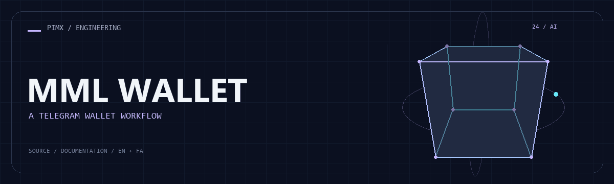

<div align="center">



**[English](README.md) · [فارسی](README.fa.md)**

</div>

<div dir="rtl">

# 👛 MML WALLET

ربات کیف پول و جمع‌آوری در تلگرام با SQLite ناهمگام، تنظیم مدیریت، ابزار keep-alive و نمایشگر دیتابیس Flask.

[GitHub](https://github.com/MOHAMMADREZAABEDINPOOR/mml-wallet) · [PIMX / Profile](https://github.com/MOHAMMADREZAABEDINPOOR) · [بنر ثابت](assets/readme/hero.png)

| نمای کلی | جزئیات |
|:---|:---|
| 👛 تجربه | ربات تلگرام و ابزارهای همراه آن |
| 🧰 فناوری | `python-telegram-bot[rate-limiter]==21.6` · `aiosqlite==0.20.0` · `flask==3.0.3` · `requests==2.32.3` |
| 🌐 زبان راهنما | [English](README.md) · [فارسی](README.fa.md) |

[✨ امکانات](#امکانات) · [🚀 شروع کار](#شروع-کار) · [⚙️ تنظیمات](#تنظیمات) · [🌍 استقرار](#استقرار)

---

<a id="امکانات"></a>

## ✨ امکانات

| بخش | قابلیت موجود |
|:---|:---|
| 🗄️ داده | پردازش ناهمگام تلگرام و ذخیره SQLite |
| 👤 حساب‌ها | تنظیم کیف پول مقصد و مدیر |
| 🔌 اتصال | سرویس اختیاری keep-alive برای میزبانی |
| 🌐 تجربه کاربری | نمایشگر مستقل Flask برای دیتابیس محلی |

<a id="پشته-فنی"></a>

## 🧰 پشته فنی

| ابزار | نسخه یا منبع |
|---|---|
| python-telegram-bot[rate-limiter]==21.6 | `requirements.txt` |
| aiosqlite==0.20.0 | `requirements.txt` |
| flask==3.0.3 | `requirements.txt` |
| requests==2.32.3 | `requirements.txt` |

<a id="شروع-کار"></a>

## 🚀 شروع کار

Python 3 و محیط دسکتاپ برای پروژه‌های Tkinter/Turtle؛ Tkinter از اجزای نصب Python است و با pip نصب نمی‌شود. برای وابستگی‌های قدیمی از نسخه Python سازگار استفاده کنید.

<div dir="ltr">

```bash
git clone https://github.com/MOHAMMADREZAABEDINPOOR/mml-wallet.git
cd mml-wallet

python -m venv .venv
# Windows: .venv\Scripts\Activate.ps1; macOS/Linux: source .venv/bin/activate
python -m pip install -r requirements.txt
# Copy env.example to .env and configure BOT_TOKEN
python main.py
```

</div>

<a id="تنظیمات"></a>

## ⚙️ تنظیمات

کلیدهای زیر از فایل نمونه یا کد استخراج شده‌اند؛ همه الزاماً اجباری نیستند. مقدار و پیش‌فرض را در همان فایل بررسی و اسرار را فقط در محیط محلی یا هاست تنظیم کنید.

| نام | کاربرد |
|---|---|
| `ADMIN_CHAT_ID` | تنظیم برنامه؛ تعریف را در منبع بررسی کنید |
| `BOT_DB_PATH` | تنظیم برنامه؛ تعریف را در منبع بررسی کنید |
| `BOT_TOKEN` | اعتبارنامه یا اتصال؛ خصوصی نگه دارید |
| `COLLECTION_WALLET` | تنظیم برنامه؛ تعریف را در منبع بررسی کنید |
| `CONTACT_EMAIL` | تنظیم برنامه؛ تعریف را در منبع بررسی کنید |
| `DATABASE_URL` | اعتبارنامه یا اتصال؛ خصوصی نگه دارید |
| `ENABLE_KEEP_ALIVE` | تنظیم برنامه؛ تعریف را در منبع بررسی کنید |
| `MODE` | تنظیم برنامه؛ تعریف را در منبع بررسی کنید |
| `PING_INTERVAL` | تنظیم برنامه؛ تعریف را در منبع بررسی کنید |
| `PING_URL` | تنظیم برنامه؛ تعریف را در منبع بررسی کنید |
| `PORT` | تنظیم برنامه؛ تعریف را در منبع بررسی کنید |
| `TOKEN_LIMIT` | اعتبارنامه یا اتصال؛ خصوصی نگه دارید |
| `WEBHOOK_URL` | تنظیم برنامه؛ تعریف را در منبع بررسی کنید |

<a id="استفاده"></a>

## 🎯 استفاده

env.example را به .env کپی و BOT_TOKEN و تنظیم کیف پول و مدیر را تعیین کنید. main.py را اجرا کنید. db_viewer.py را فقط در رابط محلی قابل اعتماد برای بررسی دیتابیس توسعه به کار ببرید.

<a id="ساختار-پروژه"></a>

## 🗂️ ساختار پروژه

| مسیر | نقش |
|---|---|
| [`assets/`](assets/) | فایل برند، رسانه و README |
| [`db_viewer.py`](db_viewer.py) | فایل ورودی یا تنظیم پروژه |
| [`main.py`](main.py) | فایل ورودی یا تنظیم پروژه |

<a id="فرمان‌ها-و-بررسی"></a>

## 🧪 فرمان‌ها و بررسی

فرمان آزمون خودکار در manifest تعریف نشده است. اجرای محلی و بررسی رفتار نمونه را انجام دهید.

<a id="استقرار"></a>

## 🌍 استقرار

ربات را با فرایند پایدار، اسرار محیطی و فضای ذخیره خصوصی میزبانی کنید. تنها یک نمونه polling اجرا کنید. تنظیم شبکه و نسخه وابستگی را روی هاست بررسی کنید.

<a id="محدودیت‌ها"></a>

## 📌 محدودیت‌ها

کد تضمین حسابداری حسابرسی‌شده، نگهداری دارایی یا تراکنش را اثبات نمی‌کند. نمایشگر عمومی می‌تواند اطلاعات کاربران را افشا کند. keep-alive تضمین پایداری هاست نیست.

<a id="رفع-مشکل"></a>

## 🛠️ رفع مشکل

- خطای سرویس یا ورود: اعتبارنامه و مدل و سرویس انتخابی را بررسی کنید.
- پیام تلگرام نمی‌رسد: حالت polling و وب‌هوک و نمونه همزمان را بررسی کنید.
- وابستگی غایب: از manifest استفاده یا در نبود آن importها را بررسی کنید.

<a id="مشارکت"></a>

## 🤝 مشارکت

برای تغییر، شاخه مستقل بسازید، رفتار فعلی را بررسی کنید و توضیح روشن همراه تغییر بفرستید. اطلاعات خصوصی، خروجی build و دیتابیس محلی را commit نکنید.

راهنماهای همراه:

- [README_KEEPALIVE.md](README_KEEPALIVE.md)

<a id="مجوز"></a>

## 📄 مجوز

فایل مجوز در این نسخه موجود نیست. نمایش عمومی کد به‌تنهایی مجوز استفاده مجدد نیست؛ برای شرایط استفاده با مالک مخزن هماهنگ کنید.

---

ساخته‌شده در مجموعه **PIMX** · مستندات فارسی و انگلیسی.

---

<div align="center">

👛 **MML WALLET** · [English](README.md) · [فارسی](README.fa.md)

</div>

</div>
